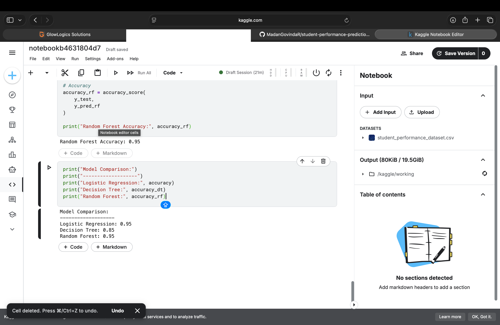
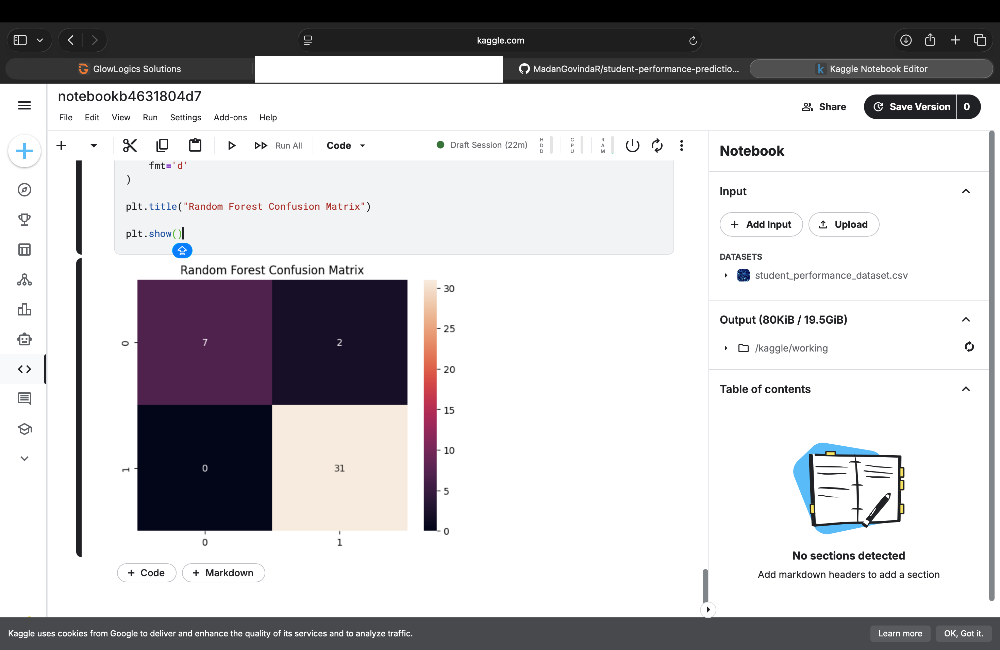
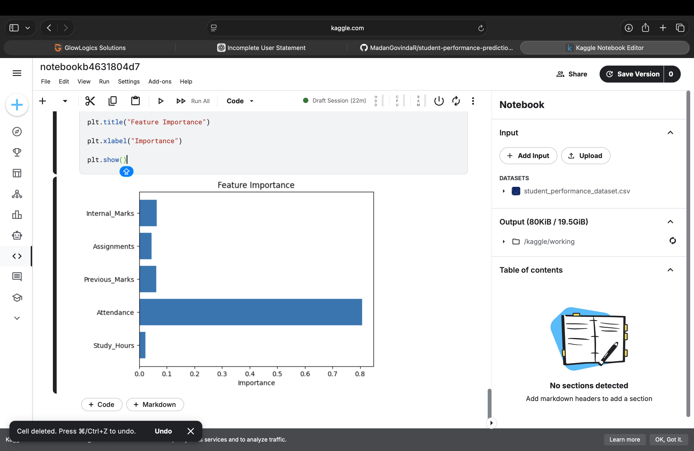

## 📸 Project Outputs

### Accuracy Output

### Confusion Matrix

### Feature Importance

---

## 📊 Sample Prediction

Example input:

Study Hours: 6  
Attendance: 85  
Previous Marks: 70  
Assignments: 80  
Internal Marks: 75  

Predicted Result: PASS
